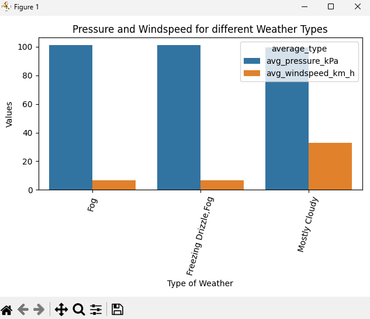

# shellenberger_streaming_06
This project will use Kafka to stream data about weather updates every hour for an entire year. The consumer will retrieve the message (data) it will locate the extract the pressure, windspeed, and weather type. The consumer will then find the average of the pressure and windspeed for each weather type and input the values into a DataFrame. In order to visualize the data using Seaborn, the DataFrame needs to be 'melted' from wide format to long format. The final part is the visualization using a barchart that will display the weather types on the x-axis with each type having two bars. Picture examples will be shown at the end of the file.

## Task 1. Setup Tools
Here are the things you need to install/download before running the project:

1. Install Python Version 3.11 and 
2. Setup Kafka, Java, and wsl (if using windows) [SETUP-KAFKA](SETUP-KAFKA.md)

## Task 2. Manage Local Project Virtual Environment

You will need to create a virtual environment with Python 3.11 for Kafka to run properly.

1. Create your .venv
``` shell
py -3.11 -m venv .venv
```
2. Activate .venv
``` shell
.venv/Scripts/activate
```
3. Install the required dependencies using requirements.txt.
``` shell
py -m pip install -r requirements.txt
```

## Task 3. Start Zookeeper and Kafka (Takes 2 Terminals)

If Zookeeper and Kafka are not already running, you'll need to restart them.
See instructions at [SETUP-KAFKA.md] to:

1. Start Zookeeper Service ([link](SETUP-KAFKA.md#step-7-start-zookeeper-service-terminal-1))
2. Start Kafka Service ([link](SETUP-KAFKA.md#step-8-start-kafka-terminal-2))

If you are having issues with starting the Kafka server, do no proceed and fix issues first.

---

## Task 4. Start Streaming Application

This will take two more terminals:

1. One to run the producer which extracts the data and writes messages.
2. Another to run the consumer which reads messages, processes them for analysis.

### Producer (Terminal 3) 

Start the producer to generate the messages. If Zookeeper and Kafka services are running, it will try to write them to a Kafka topic. For configuration details, see the .env file. 

In VS Code, open a **NEW** terminal.
Use the commands below to activate .venv, and start the producer. 

Windows:

```shell
.venv\Scripts\activate
py -m producers.producer_shellenberger
```

Mac/Linux:
```zsh
source .venv/bin/activate
python3 -m producers.producer_shellenberger
```

The producer will still work if Kafka is not available.

### Consumer (Terminal 4) - Two Options

Start the consumer that reads from the Kafka topic.

In VS Code, open a **NEW** terminal in your root project folder. 
Use the commands below to activate .venv, and start the consumer. 

Windows:
```shell
.venv\Scripts\activate
py -m consumers.consumer_shellenberger
```

Mac/Linux:
```zsh
source .venv/bin/activate
python3 -m consumers.consumer_shellenberger
```

## Example Chart

